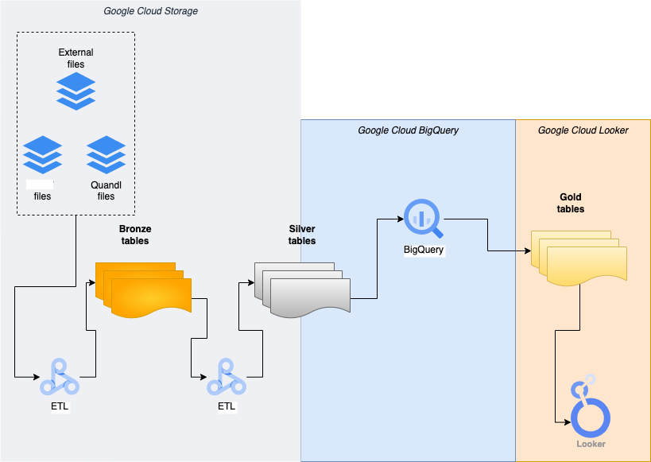

# Deeploans Data Lakehouse ETL Pipeline

This repository hosts the ETL pipelines for creating the Deeploans data lakehouse, where raw data from external providers is processed and stored.

The **Lakehouse Architecture** combines the flexibility of a data lake with the structured data management capabilities of a data warehouse.



## Data Location and Infrastructure
The raw data resides in a Google Cloud Storage (GCS) bucket, where it is securely stored before processing. The pipeline leverages **GCP Dataproc Serverless** and **Google Cloud Composer** to automate and manage data transformations across the different layers of the lakehouse.

## Lakehouse Schema

The data lakehouse schema is designed with three layers, each with specific processing and transformation objectives:

1. **Bronze Layer**:
    - Objective: Store a one-to-one copy of the raw data, minimally processed with essential data profiling checks.
    - Transformations: Basic profiling rules are applied, including adding columns to support Slow Changing Dimension (SCD) Type 2.

2. **Silver Layer**:
    - Objective: Cleaned and normalized data, where raw data is transformed to separate dimensions for efficient querying and ML preparation.
    - Transformations: Dimensional normalization and transformations for BI and ML features.
      
3. **Gold Layer**:
    - Objective: Prepare data for business metrics and machine learning models.
    - Transformations: The data is refined for business KPIs or machine learning features.
    - Tools:
        - BI and Analytics: Processed with Looker Studio for dashboard and plot preparation.
        - Machine Learning: Further processed using Dataproc Serverless or DataFlow for ML feature engineering.
     

## Data Profiling Stages
Two levels of data profiling ensure data quality and integrity before advancing data to subsequent layers:

- *Bronze-Level Profiling*: Ensures basic data quality checks for raw data before storage in the Bronze layer.
  Key rules include:
   - Ensuring primary key uniqueness and completeness
   - Verifying table and column integrity (e.g., no NULL values in required fields)
   - Confirming the presence of essential columns
- *Silver-Level Profiling*: Applied to Silver layer data before allowing it to be processed in the Gold layer. These rules vary based on asset class and file type.

## Asset Classes

The asset classes covered are: 

-  SME loans
-  Residential Mortgages
-  Consumer Lending 
-  Auto loans 
-  Leasing (Dec 24)
-  Credit card (Dec 24)

## Data Assumptions

Primary keys for various datasets are based on a combination of unique identifiers:

- Assets: `dl_code` + `Loan ID` (e.g. AS3 for SME Loans)
- Collateral: `dl_code` + `Collateral ID` (e.g. CS1 for SME loans)
- Bond Information: `dl_code` + `Report Date` (BS1 for SME loans) + `Issuer` (BS2 for SME loans)
- Amortization: `dl_code` + `AS3` (relevant for SME loans only)

## Running the ETL Pipeline

To run the project, follow these steps:

1. Clone the Repository: Ensure that **gcloud CLI** is installed and set up to access the `your project_id` project on GCP.

2. Edit Configuration: Modify the `Makefile` if the data is located in a different GCS bucket or folder.

3. Build and Deploy:
   - Run the following command to prepare the code and upload it to GCP:
     ```bash
     > make setup && make build
     ```
4. Start the workflow
   - Upload the relevant Directed Acyclic Graph (DAG) file to Google Cloud Composer.
   - Start the workflow in two stages to manage parallelism and avoid file write conflicts:
     - **Stage 1**: Run the DAG to perform Bronze-level profiling and data generation. Set the `max_active_tasks` parameter to a value greater than 1 to enable parallel task execution.
     - **Stage 2**: Modify the DAG to process only Silver-level data generation. Set `max_active_tasks` to 1 to prevent concurrent writes on the parquet files.
