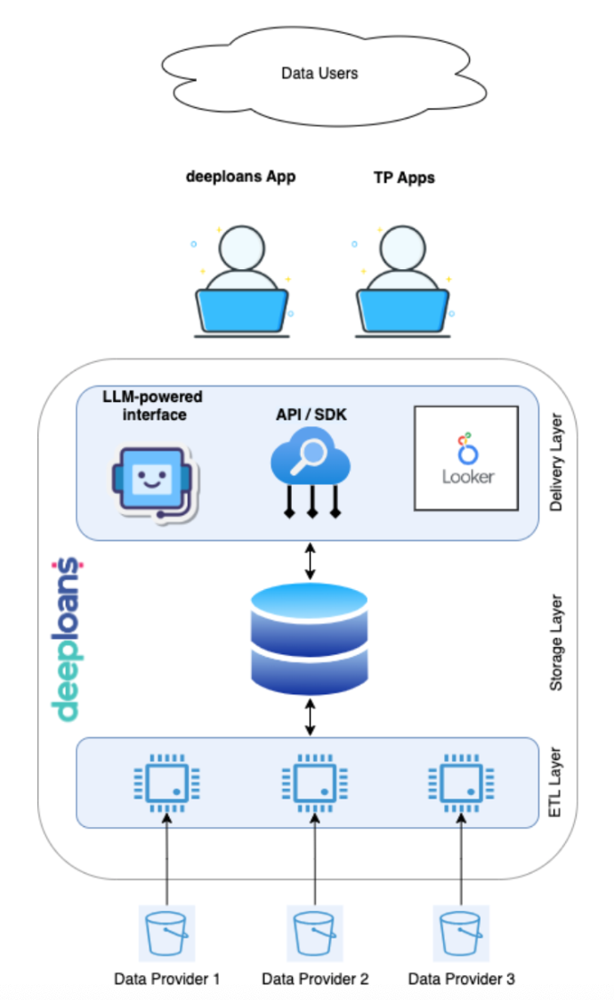

# Deeploans Open Source Project

Deeploans, a data processing software for loan-level, economic and alternative credit data delivered in modern formats for today's analysts, data scientists and developers.

