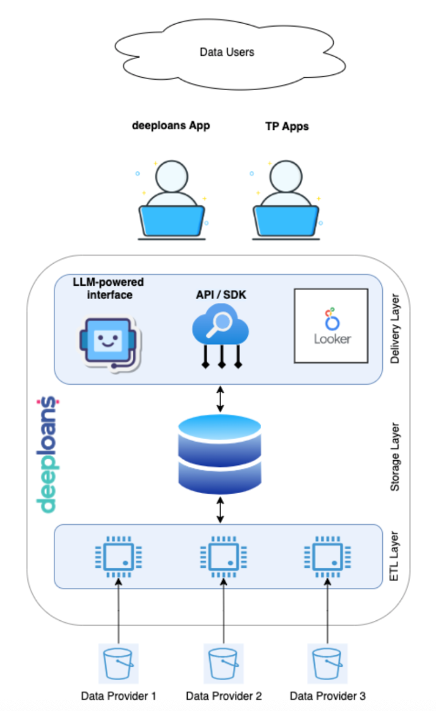

# deeploans overview

deeploans is an open-source **ETL** framework designed for working with **granular asset data**. It extracts, cleans, transforms, and standardizes **datasets**, making them easier to use in analytics, machine learning models, and downstream applications.

Initially developed as an advanced credit risk analytics tool for portfolio managers and bankers, deeploans evolved into an open data infrastructure project to address the industry-wide challenge of **inconsistent** and **fragmented financial data**. It enables users to:

- Ingest loan-level datasets from multiple sources.
- Process and standardize data formats for easier integration.
- **Validate** and **clean** incomplete or inconsistent records.
- Output **better-structured data** suitable for analysis, modeling, data science or reporting.

deeploans is designed for analysts, data scientists, and developers working with granular asset data who need an efficient and cost-effective way to handle structured datasets without relying on third-party providers. It supports modern data workflows and removes the bottlenecks associated with manual data preparation.

deeploans includes ETLs for the following structured finance datasets:
- Auto Loans
- SME Loans
- Consumer Loans
- Residential Mortgages
- Commercial Mortgages

Additional components in this repository include:

- `api/api-backend-main/`: FastAPI backend for data access
- `app-library/`: A library of (MVP) applications that run on top of deeploans
- `mcp-server/`: standalone MCP server for AI/client integrations

# Licence

Deeploans is available under the Apache licence. See here for [full text](https://www.apache.org/licenses/LICENSE-2.0). 
 

# How to get involved

deeploans is a growing open-source project where developers and data analysts can directly shape the future of their tools and infrastructure. 

🛠 **Help build deeploans**
 
We’re actively expanding deeploans, and now is the perfect time to jump in. Whether you’re experienced with ETL pipelines, data processing, or just getting started, now is the time to become a core part of the deeploans project.

🔨 **Code contributions**
 
Got an idea to improve our data processing? Spotted something that could use some tweaking? Even smaller contributions can make a real impact.

📊 **Test and give feedback**
 
Not a developer? No problem. Run Deeploans with real data, report bugs, and let us know how it performs. Your feedback makes the tool more robust for everyone.
Have an idea for improvement? Open a discussion—real-world testing is just as valuable as coding.

📖 **Improve the docs**
 
Documentation is everything. If something unclear or missing, your contributions to our docs can help the next developer get started faster.

💡**Feature requests & ideas**
 
Got a use case we haven’t covered? Open an issue or drop a comment in [Discussions](https://github.com/orgs/Algoritmica-ai/discussions) to brainstorm.
 

## Get started

- **Fork the repo** and clone it locally.
- Explore the codebase and try it out.
- Have an idea? Open a discussion to talk about potential contributions.
- Once issues are posted, grab one and submit a pull request when you're ready.
- Stay tuned to join the community on Discord!
 

# Contacts

To get in touch, drop an email at:
- [luca.borella@algoritmica.ai](mailto:luca.borella@algoritmica.ai)
- [dylan.thiam@algoritmica.ai](mailto:dylan.p.thiam@algoritmica.ai)

# deeploans background

deeploans began as an AI-powered analytics tool designed to help portfolio managers predict default risk. 

However, we quickly recognised a fundamental challenge: before the market can adopt more advanced tools, it needs clean and better-structured data.

Thus, deeploans evolved into an open data infrastructure project. Today, deeploans solves the fragmented, inconsistent and incomplete data problem in finance, enabling analysts and developers to build better tools. 
